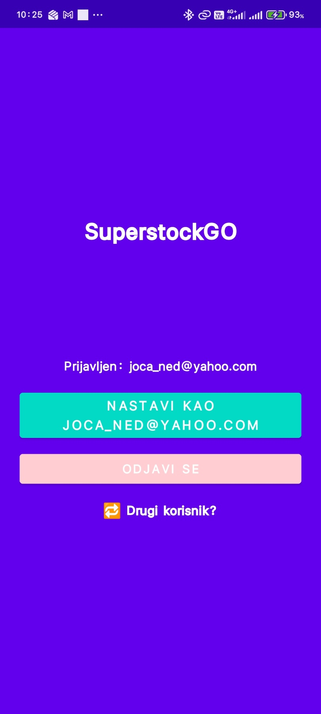
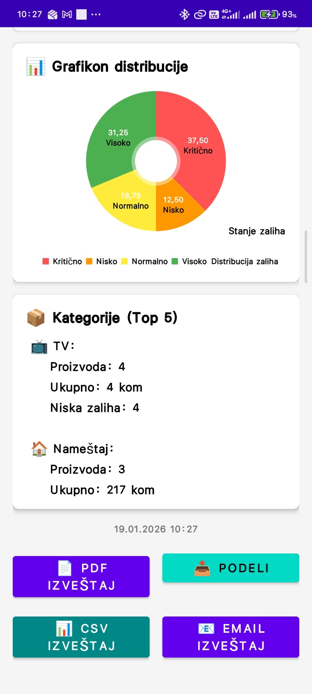
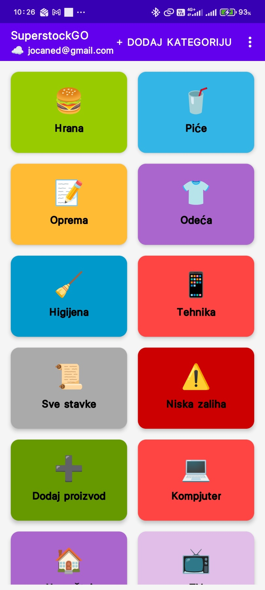
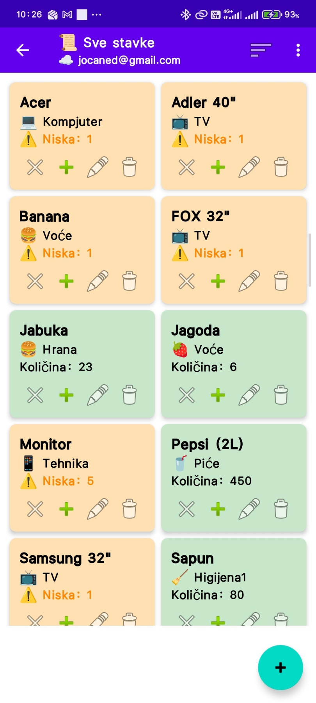
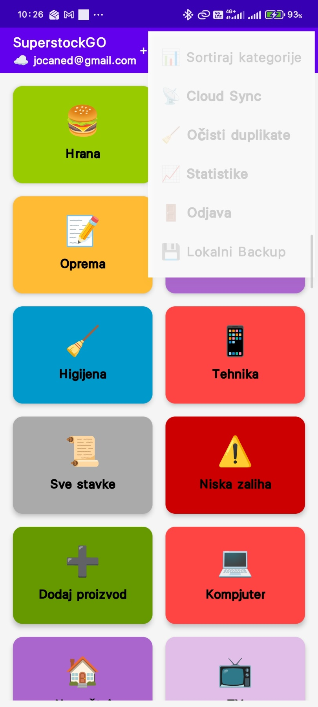

# SuperstockGO 📱

Android aplikacija za upravljanje zalihama i inventarom.

## 📸 Screenshots

<table>
  <!-- PRVI RED: 5 SLIKA -->
  <tr>
    <td></td>
    <td></td>
    <td></td>
    <td></td>
    <td></td>
  </tr>
  <tr>
    <td>
<b>Login ekran</b>
</td>
    <td>
<b>Lokalni Backup & Restore</b>
</td>
    <td>
<b>Statistike</b>
</td>
    <td>
<b>Statistike</b>
</td>
    <td>
<b>Kategorije</b>
</td>
  </tr>
  
  <!-- DRUGI RED: 5 SLIKA -->
  <tr>
    <td></td>
    <td></td>
    <td></td>
    <td></td>
    <td></td>
  </tr>
  <tr>
    <td>
<b>Kategorije</b>
</td>
    <td>
<b>Lista artikala</b>
</td>
    <td>
<b>Sortiranje artikala</b>
</td>
    <td>
<b>Glavni Meni</b>
</td>
    <td>
<b>Cloud sinhronizacija</b>
</td>
  </tr>
</table>

## ✨ Funkcionalnosti
- 📊 Upravljanje inventarom
- ☁️ Cloud sinhronizacija sa Firebase-om
- 💾 Lokalni backup i restore
- 📈 Statistike i izveštaj
- 🔔 SMS notifikacije za nisku zalihu
- 🎨 Custom kategorije sa emoji

## 🛠 Tehnologije
- **Kotlin** - Glavni programski jezik
- **Firebase** - Realtime Database i Authentication
- **SQLite** - Lokalna baza podataka
- **MPAndroidChart** - Grafikoni i statistike
- **Material Design** - UI komponente

## 📁 Struktura projekta
SuperstockGO/
├── app/
│ ├── src/main/java/com/jovannedeljkovic/superstockgo/
│ │ ├── MainActivity.kt
│ │ ├── KategorijeActivity.kt
│ │ ├── CloudSyncActivity.kt
│ │ ├── StatsActivity.kt
│ │ └── ...
│ ├── src/main/res/ # Resursi (layout, drawable, values)
│ └── build.gradle
├── screenshots/ # Folder sa screenshotovima
│ ├── main.jpg
│ ├── screenshot_1.jpg
│ └── ...
├── gradle/
└── build.gradle